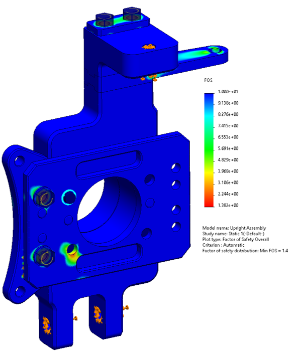
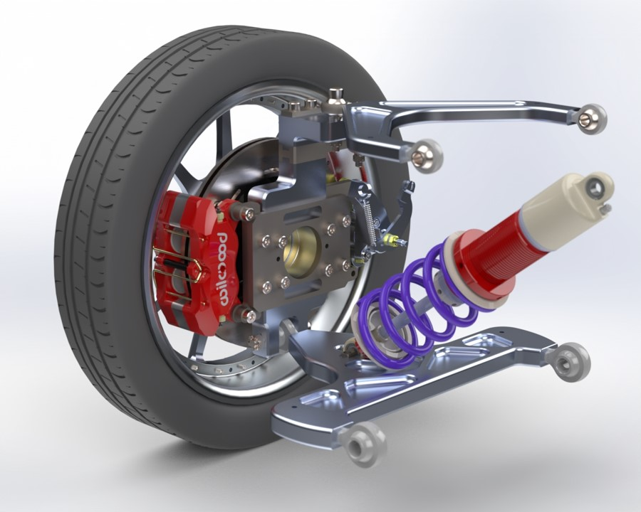

# Solar Car Front Suspension
The McMaster Solar Car Front Suspension assembly and my role in it's contribution as a Suspension and Dynamics Subteam member

## Engineering Overview: Role in Front Assembly Team

As a member of the Suspension and Dynamics subteam, my primary responsibilities included the design, analysis, manufacturing, and optimization of the vehicle’s suspension and driving dynamics. My contributions were critical during the front suspension system's early design and manufacturing phases.  
### Key Contributions:

**Simulation and Analysis of Front Upright Assembly:**

+ Conducted stress analysis on the Front Upright Assembly to evaluate critical failure points and ensure a Factor of Safety (FOS) of at least 1.4.

+ Identified primary areas of concern, including the Control Arm and the Upper Control Arm (UCA) Mount, both of which exhibited shear failure under load.  

**Control Arm Improvements:**

+ Enhanced the Control Arm by adding structural ribs along the high-stress regions.  
- Incorporated a central pin to evenly distribute shear forces, significantly improving the component’s durability.

 

**Redesign of UCA Mount:**

- Redesigned the UCA Mount to simplify its geometry, improving manufacturability while addressing shear stress concerns, which are shown in the image below.  
- Introduced a distribution plate to offset pin shear, ensuring improved load distribution and structural integrity.  

**Restoration of Full Upright Assembly:**

- Resolved inconsistencies in the assembly, including missing files, misaligned components, and non-compliant bolts.  
- Verified that all bolts adhered to specifications and ensured the dynamic functionality of the assembly.

**Assembly Drawing Creation:**

- Produced an exploded assembly drawing detailing all major components and required quantities for manufacturing and backup purposes.  
- Simplified the drawing by excluding bolts to focus on the core elements, making it a practical reference for optimization and improvement discussions.  
